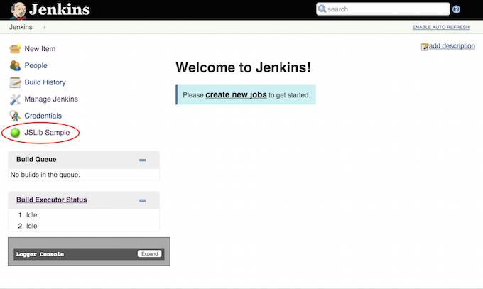

# Step 01 - A "basic" Plugin
A basic Jenkins plugin with just a standard Jenkins "root action" page that contains
a simple form. This plugin is the foundation for all other sample plugins in this repo.

<p>
<ol>
    <li><a href="#how-to-run">How to run</a><br/>
    <li><a href="HOW-IT-WORKS.md">How it works</a><br/>
</ol>    
</p>

## How to run
The easiest way to run this Jenkins plugin is to [use the standard Maven HPI plugin for Jenkins](https://wiki.jenkins-ci.org/display/JENKINS/Plugin+tutorial#Plugintutorial-DebuggingaPlugin).

```sh
$ mvn hpi:run
```

On running the plugin, you will see the following screens.




## How it works

<a href="HOW-IT-WORKS.md"></a>

<hr/>
<b><a href="../../../tree/master/step-02-nodeify">&gt;&gt; NEXT (step-02-nodeify) &gt;&gt;</a></b>

[Plugin Tutorial]: https://wiki.jenkins-ci.org/display/JENKINS/Plugin+tutorial
[jenkins-js-builder]: https://github.com/jenkinsci/js-builder
[CommonJS]: http://www.commonjs.org/
