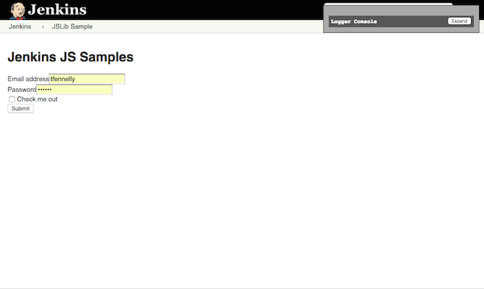

# Step 02 - Add CommonJS modules ("nodeify") - How it works
The plugin in this step (`step-02-nodeify`) builds on top of <a href="../../../tree/master/step-01-basic">step-01-basic</a>,
adding some [CommonJS] modules. We use [jenkins-js-builder] and some other [Node.js]
tools to build a self contained browser-ready JavaScript "[bundle]" that can be loaded through your Jenkins `.jelly` files
(or whatever mechanism works for your plugin).

There are a few simple steps to adding [CommonJS] modules to your plugin.

<p>
<ol>
    <li><a href="#install-nodejs-and-gulp">Install Node.js and Gulp</a><br/>
    <li><a href="#add-packagejson">Add `package.json`</a><br/>
    <li><a href="#add-initial-npm-packages">Add initial NPM packages</a><br/>
    <li><a href="#add-first-commonjs-module">Add first CommonJS module</a><br/>
    <li><a href="#add-gulpfilejs">Add `gulpfile.js`</a><br/>
    <li><a href="#build-the-javascript-bundle-for-the-browser">Build the JavaScript bundle for the Browser</a><br/>
    <li><a href="#add-the-javascript-bundle-to-the-jelly-page">Add the JavaScript bundle to the .jelly page</a><br/>
    <li><a href="#test-run">Test run</a><br/>
    <li><a href="#integrate-gulp-and-maven-builds">Integrate Gulp and Maven builds</a><br/>
</ol>    
</p>
 
## Install Node.js and Gulp 
On your dev machine, install [Node.js] v4.0.0+.

You'll also need to globally install [Gulp].
  
```sh
$ npm install --global gulp
```

> __NOTE__ that [Node.js] and [Gulp] only needs to be installed on Dev machines so as to allow the running of node/npm/gulp etc commands while developing the plugin. A simple check out and build of your plugin (using maven) will NOT require [Node.js] to be installed on the build machine. The maven build will take care of everything.

## Add `package.json`
Add a `package.json` file to the root of your plugin using the [`npm init`](https://docs.npmjs.com/cli/init) command.

```sh
$ npm init
This utility will walk you through creating a package.json file.
It only covers the most common items, and tries to guess sensible defaults.

See 'npm help json' for definitive documentation on these fields
and exactly what they do.

Use 'npm install <pkg> --save' afterwards to install a package and
save it as a dependency in the package.json file.

Press ^C at any time to quit.
name: (step-02-nodeify)
```

## Add initial NPM packages
Install the minimum set of NPM packages required for your plugin to build ([gulp](https://github.com/gulpjs/gulp), [jenkins-js-builder] and [jenkins-js-modules]).

```sh
$ npm install --save-dev gulp @jenkins-cd/js-builder
$ npm install --save @jenkins-cd/js-modules
```

Let's also install the jquery package.

```sh
$ npm install --save jquery
```

## Add first CommonJS module
Create `src/main/js/jslib-samples.js` and add the following JavaScript code:

```javascript
var $ = require('jquery');

$(document).ready(function () {    
    $('#side-panel').remove();
    $('#main-panel').css('margin-left', '0px');
});
```

This silly little [CommonJS] module will just use jQuery to remove the left side-panel. Of
course we could add more [CommonJS] modules in `src/main/js` and use them in our App.

## Add `gulpfile.js`
Add a `gulpfile.js` file to the root of your plugin.

`gulpfile.js` will not contain a lot of code. Most of the work is done by [jenkins-js-builder]. 

```javascript
var builder = require('@jenkins-cd/js-builder');

//
// Bundle the modules.
// See https://github.com/jenkinsci/js-builder
//
builder.bundle('src/main/js/jslib-samples.js');
```

The `builder.bundle` command is asking [jenkins-js-builder] to create a [bundle] (using [Browserify]) starting from
`src/main/js/jslib-samples.js`, and to output the generated [bundle] file to the `target/classes` folder, allowing the
`.js` bundle to be loaded as an adjunct. The generated [bundle] file will be totally self contained (containing a private
copy of jQuery and anything else used by the App) and loadable in a browser.
 
## Build the JavaScript bundle for the Browser
To build the [bundle], simple run:

```sh
$ gulp
```

You should see output like the following:

```sh
$ gulp
[11:07:27] **********************************************************************
[11:07:27] This build is using Jenkins JS Builder.
[11:07:27]   For command line options and other help, go to
[11:07:27]   https://www.npmjs.com/package/@jenkins-cd/js-builder
[11:07:27] **********************************************************************
[11:07:27] Maven project.
[11:07:27] 	- Jenkins plugin (HPI): step-02-nodeify
[11:07:27] Language level set to ECMA v5. Call builder.lang([number]) to change.
[11:07:27] Defining default tasks...
[11:07:27] Using gulpfile ~/projects/jenkins-plugins/jenkins-js-samples/step-02-nodeify/gulpfile.js
[11:07:27] Starting 'lint'...
[11:07:28] 	- Using the "es5" eslint configuration from eslint-config-jenkins. Override by defining a .eslintrc in this folder (if you really must).
[11:07:28] Finished 'lint' after 549 ms
[11:07:28] Starting 'log-env'...
[11:07:28] Source Dirs:
[11:07:28]  - src: src/main/js,src/main/less
[11:07:28]  - test: src/test/js
[11:07:28] Finished 'log-env' after 599 μs
[11:07:28] Starting 'bundle_jslib-samples'...
[11:07:28] Javascript bundle "jslib-samples" will be available in Jenkins as adjunct "org.jenkins.ui.jsmodules.step_02_nodeify.jslib-samples".
[11:07:29] Finished 'bundle_jslib-samples' after 1.53 s
[11:07:29] Starting 'bundle'...
[11:07:29] bundling: done
[11:07:29] Finished 'bundle' after 207 μs
[11:07:29] Starting 'test'...
[11:07:29] Test specs: src/test/js/**/*-spec.js
[11:07:29] Testing web server started on port 18999 (http://localhost:18999). Content root: /Users/tfennelly/projects/jenkins-plugins/jenkins-js-samples/step-02-nodeify
[11:07:29] Finished 'test' after 54 ms
[11:07:29] Starting 'default'...
[11:07:29] Finished 'default' after 3.77 μs
SUCCESS: 0 specs, 0 failures, 0 skipped, 0 disabled in 0.001s.
[11:07:30] Testing web server stopped.
```

The part of the build output that's of most interest to us here is:

```sh
[11:07:28] Javascript bundle "jslib-samples" will be available
           in Jenkins as adjunct "org.jenkins.ui.jsmodules.step_02_nodeify.jslib-samples".
```

This tells us where the generated `.js` [bundle] can be loaded from as a Jenkins adjunct i.e. `org.jenkins.ui.jsmodules.step_02_nodeify.jslib-samples`.
We will use this information in the next section.

## Add the JavaScript bundle to the .jelly page
Using the information from the previous section, it's easy to determine how to load the [bundle] in Jenkins via the
`.jelly` file. In this example we will use a Jenkins adjunt, adding it to
[JSLibSample/index.jelly](src/main/resources/org/jenkinsci/ui/samples/JSLibSample/index.jelly).

```html
<st:adjunct includes="org.jenkins.ui.jsmodules.step_02_nodeify.jslib-samples"/>
```

> Note: The `org.jenkins.ui.jsmodules.step_02_nodeify.jslib-samples` adjunct identifier translates to an adjunct URL of the form `http://localhost:8080/<adjuncts-url>/org/jenkins/ui/jsmodules/step_02_nodeify/jslib-samples.js`.
> The `<adjuncts-url>` prefix is typically something like `jenkins/adjuncts/1cc49125`. In JavaScript code, it can typically be accessed using the `getAdjunctURL()` method of the `@jenkins-cd/js-modules` package. 

## Test run
At this stage, you should be able to take `step-02-nodeify` for a test run and see how the Modularized JavaScript
behaves. You can do this by simply [running the plugin using the HPI plugin](https://wiki.jenkins-ci.org/display/JENKINS/Plugin+tutorial#Plugintutorial-DebuggingaPlugin).



As you can see, the [bundle] ran fine and used jQuery (contained in the [bundle]) to remove the left side-panel.

## Integrate Gulp and Maven builds
You will want to run the `gulp` build (to generate the [bundle]) as part of your plugin's Maven build. For that reason, 
the `gulp` build needs to be integrated into the `mvn` build lifecycle.

If your plugin's parent POM is `org.jenkins-ci.plugins:plugins:1.639` or newer, no action is required. If your
plugin depends on an older parent POM, then you will need to add the maven `<profile>`s referred to in the
[sample_extract_pom.xml](https://github.com/jenkinsci/js-builder/blob/master/res/sample_extract_pom.xml) in
[Maven Integration](https://github.com/jenkinsci/js-builder#maven-integration) section of the [jenkins-js-builder] docs.

<hr/>
<p align="center">
<b><a href="../../../tree/master/step-01-basic">&lt;&lt; PREV (step-01-basic) &lt;&lt;</a>  &nbsp;&nbsp;&nbsp;&nbsp;&nbsp;&nbsp;&nbsp;&nbsp;&nbsp;&nbsp;&nbsp;  <a href="../../../tree/master/step-03-more-npm-packs">&gt;&gt; NEXT (step-03-more-npm-packs) &gt;&gt;</a></b>
</p>

[Node.js]: https://nodejs.org
[Gulp]: https://github.com/gulpjs/gulp
[jenkins-js-builder]: https://github.com/jenkinsci/js-builder
[jenkins-js-modules]: https://github.com/jenkinsci/js-modules
[CommonJS]: http://www.commonjs.org/
[jquery-detached]: https://github.com/tfennelly/jquery-detached
[Browserify]: http://browserify.org/
[bundle]: https://github.com/jenkinsci/js-modules/blob/master/FAQs.md#what-is-the-difference-between-a-module-and-a-bundle
