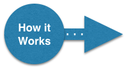

# Step 04 - Externalize Dependency Libraries (slim down)
In this plugin (`step-04-externalize-libs`), we build on top of <a href="../../../tree/master/step-03-more-npm-packs">step-03-more-npm-packs</a>,
changing it to load HPI bundled versions of [bootstrap-detached]
and Moment.js. This means that `step-04-externalize-libs`s `.js` [bundle] will no longer include these dependencies
and it's size will reduce to less than 30Kb (as opposed to 300Kb).

<p>
<ol>
    <li><a href="#how-to-run">How to run</a><br/>
    <li><a href="HOW-IT-WORKS.md">How it works</a><br/>
</ol>    
</p>

## How to run
The easiest way to run this Jenkins plugin is to [use the standard Maven HPI plugin for Jenkins](https://wiki.jenkins-ci.org/display/JENKINS/Plugin+tutorial#Plugintutorial-DebuggingaPlugin).

```sh
$ mvn hpi:run
```

Nothing visual changes from <a href="../../../tree/master/step-03-more-npm-packs">step-03-more-npm-packs</a> to this plugin.
The only difference is in <a href="HOW-IT-WORKS.md">how it works</a>, specifically in how it loads JavaScript dependency
libraries.

The easiest way to see this is through the Browsers Developer Tools.
 


`jslib-samples.js` triggers the loading of `bootstrap3.js` and `momentjs2.js`. In turn, `bootstrap3.js` has a
dependency on [jquery-detached](https://github.com/jenkinsci/js-libs/tree/master/jquery-detached), resulting in the
loading of `jquery2.js`.
  
The main point here is that if you have a Jenkins page that loads multiple [bundle]s, many of which are loading common
dependencies such as jQuery, Bootstrap etc, then you only need to load those dependencies once and share then between the
different [bundle]s. And of course, the [bundle]s themselves are considerably lighter because they no longer contain
these dependencies.

## How it works

<a href="HOW-IT-WORKS.md"></a>

<hr/>
<p align="center">
<b><a href="../../../tree/master/step-03-more-npm-packs">&lt;&lt; PREV (step-03-more-npm-packs) &lt;&lt;</a>  &nbsp;&nbsp;&nbsp;&nbsp;&nbsp;&nbsp;&nbsp;&nbsp;&nbsp;&nbsp;&nbsp;  <a href="../../../tree/master/step-05-namespaced-css">&gt;&gt; NEXT (step-05-namespaced-css) &gt;&gt;</a></b>
</p>

[Node.js]: https://nodejs.org
[Gulp]: https://github.com/gulpjs/gulp
[jenkins-js-builder]: https://github.com/jenkinsci/js-builder
[jenkins-js-modules]: https://github.com/jenkinsci/js-modules
[jenkins-js-libs]: https://github.com/jenkinsci/js-libs
[CommonJS]: http://www.commonjs.org/
[jquery-detached]: https://github.com/tfennelly/jquery-detached
[bootstrap-detached]: https://github.com/tfennelly/bootstrap-detached
[Browserify]: http://browserify.org/
[bundle]: https://github.com/jenkinsci/js-modules/blob/master/FAQs.md#what-is-the-difference-between-a-module-and-a-bundle

