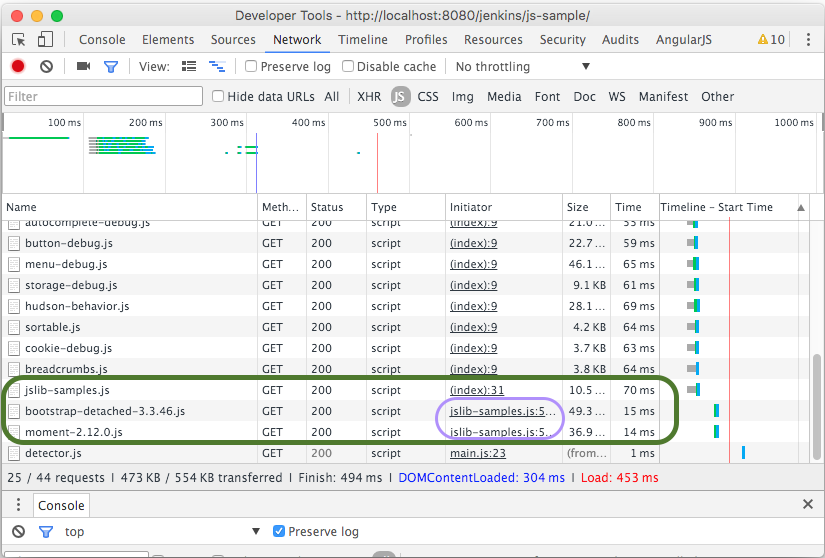

# Step 04 - Externalize Dependency Libraries (slim down)
With `step-03-more-npm-packs`, we have a plugin using Modularized [CommonJS] style JavaScript, which is good. Using
[CommonJS] means we can easily use any of the huge number of JavaScript packages available in the NPM registry.

This is great, but one of the issues with `step-03-more-npm-packs` is that its [bundle] contains everything it needs,
including jQuery, Bootstrap, Moment.js and anything else we might add. This results in a quite bloated `.js` [bundle]
for `step-03-more-npm-packs` - roughly 300Kb. If a given Jenkins page loads multiple `.js` bundles like this, it will
potentially result in multiple jQuery instances (and Bootstrap, Moment.js etc) being loaded. What we really want in
this kind of situations is to have slimmer/lighter "App" bundles, all sharing the same jQuery etc.

In `step-04-externalize-libs`, we will use [jenkins-js-modules] to load HPI bundled versions of [bootstrap-detached]
and Moment.js. This means that `step-04-externalize-libs`s `.js` [bundle] will no longer include these dependencies
and it's size will reduce to less than 30Kb (as opposed to 300Kb). Note that this change should not require app `.js`
code changes. The only changes should be in how we build the app [bundle].

[jenkins-js-libs] contains HPI bundled versions of [bootstrap-detached] etc. Browse around [jenkins-js-libs] and take
note of what's currently available. We will be adding more over time. 

## Install `jenkins-js-modules` NPM package
[jenkins-js-modules] is a bundle loader. It will let the `step-04-externalize-libs` app [bundle] load external
dependencies from the [jenkins-js-libs] HPI plugins at runtime Vs having to include those dependencies directly in its
own `js` bundle.

```sh
$ npm install --save jenkins-js-modules
```

## Add HPI plugin dependencies
Because we are changing the `step-04-externalize-libs` app [bundle] to load its external dependencies (bootstrap and 
momentjs) from HPI plugins (using [jenkins-js-modules]), we need to add maven dependencies on those HPI plugins so as to
ensure they get installed/loaded in Jenkins at runtime (and so are available for loading to the UI at runtime).

So, change the `pom.xml` to add dependencies on the [bootstrap](https://github.com/jenkinsci/js-libs/tree/master/bootstrap)
and [momentjs](https://github.com/jenkinsci/js-libs/tree/master/momentjs) HPI plugins:

```diff
@@ -1,19 +1,35 @@
 <?xml version="1.0" encoding="UTF-8"?>
 <project xmlns="http://maven.apache.org/POM/4.0.0" xmlns:xsi="http://www.w3.org/2001/XMLSchema-instance"
          xsi:schemaLocation="http://maven.apache.org/POM/4.0.0 http://maven.apache.org/maven-v4_0_0.xsd">
     <modelVersion>4.0.0</modelVersion>
 
     <parent>
         <groupId>org.jenkins-ci.ui.samples</groupId>
         <artifactId>jenkins-js-samples</artifactId>
         <version>1.0-SNAPSHOT</version>
         <relativePath>../</relativePath>
     </parent>
     <artifactId>step-04-externalize-libs</artifactId>
     <version>1.0</version>
     <packaging>hpi</packaging>
 
     <name>JS Lib Samples: Step 4 - Externalize JS Libs</name>
     <description>A sample that externalizes the framework libs Vs bundling them all</description>
+    
+    <dependencies>
+        <!-- Load the framework libs from plugins Vs bundling them in an uber-bundle. -->
+        <dependency>
+            <groupId>org.jenkins-ci.ui</groupId>
+            <artifactId>bootstrap</artifactId>
+            <version>1.1</version>
+            <type>hpi</type>
+        </dependency>
+        <dependency>
+            <groupId>org.jenkins-ci.ui</groupId>
+            <artifactId>momentjs</artifactId>
+            <version>1.0</version>
+            <type>hpi</type>            
+        </dependency>
+    </dependencies>
 
 </project>
```

## Configure Node build to load external dependencies
The last step is to modify `gulpfile.js`, telling the [bundle] process link in [bootstrap](https://github.com/jenkinsci/js-libs/tree/master/bootstrap)
and [momentjs](https://github.com/jenkinsci/js-libs/tree/master/momentjs), and so NOT include them in the generated [bundle]
(making it considerably smaller etc).

The changes are simply to add the relevant `withExternalModuleMapping` [jenkins-js-builder] calls in `gulpfile.js`.

```diff
@@ -1,8 +1,10 @@
 var builder = require('jenkins-js-builder');
 
 //
 // Bundle the modules.
 // See https://github.com/jenkinsci/js-builder
 //
 builder.bundle('src/main/js/jslib-samples.js')
+       .withExternalModuleMapping('bootstrap-detached', 'bootstrap:bootstrap3')
+       .withExternalModuleMapping('moment', 'momentjs:momentjs2')
        .inDir('src/main/webapp/jsbundles');
```

[See jenkins-js-builder docs for more on withExternalModuleMapping](https://github.com/jenkinsci/js-builder#step-4-optional-specify-external-module-mappings-imports).
Get the bundle QName ("bootstrap:bootstrap3" etc) from the relevant pages on [jenkins-js-libs]. 

## Test run
Now take `step-04-externalize-libs` for a test run and see the effect of these changes. What you'll see is that
nothing has changed visually i.e. still works the same time a user perspective. The difference is in HOW it works.

The `jslib-samples.js` [bundle] no longer contains [bootstrap](https://github.com/jenkinsci/js-libs/tree/master/bootstrap),
[momentjs](https://github.com/jenkinsci/js-libs/tree/master/momentjs) and 
[jquery](https://github.com/jenkinsci/js-libs/tree/master/jquery-detached). Instead, it loads the dependencies at runtime
from the [jenkins-js-libs] HPI plugins.
 
The easiest way to see this is through the Browsers Developer Tools.
 


Using [jenkins-js-modules], `jslib-samples.js` triggers the loading of `bootstrap3.js` and `momentjs2.js` from their
[jenkins-js-libs] HPI plugins. In turn, `bootstrap3.js` has a dependency on
[jquery-detached](https://github.com/jenkinsci/js-libs/tree/master/jquery-detached), resulting in the loading of `jquery2.js`.

<hr/>
<b><a href="../../../tree/master/step-02-nodeify">&lt;&lt; PREV (step-02-nodeify) &lt;&lt;</a>  |||  <a href="../../../tree/master/step-04-externalize-libs">&gt;&gt; NEXT (04-externalize-libs) &gt;&gt;</a></b>

[Node.js]: https://nodejs.org
[Gulp]: https://github.com/gulpjs/gulp
[jenkins-js-builder]: https://github.com/jenkinsci/js-builder
[jenkins-js-modules]: https://github.com/jenkinsci/js-modules
[jenkins-js-libs]: https://github.com/jenkinsci/js-libs
[CommonJS]: http://www.commonjs.org/
[jquery-detached]: https://github.com/tfennelly/jquery-detached
[bootstrap-detached]: https://github.com/tfennelly/bootstrap-detached
[Browserify]: http://browserify.org/
[bundle]: https://github.com/jenkinsci/js-modules/blob/master/FAQs.md#what-is-the-difference-between-a-module-and-a-bundle

